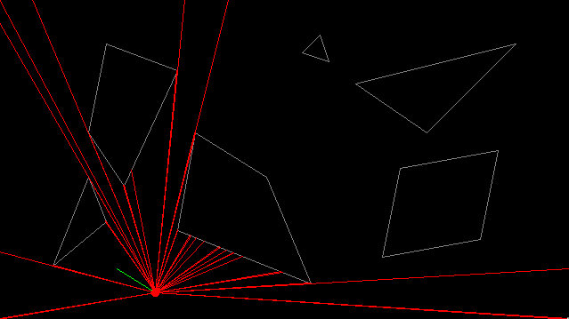

# Raycasting

This is raycasting implementations.

## Preview




## Disclaimer

This project is only a draft and the code quality is bad.

## Implementations

There is two implementations :

* 2D with App.java
* 3D with App3D.java

If you launch the 3D app, 2D and 3D renderings will be launched with the same scene.

## How to use

There are some keybinding :

* `z` to move forward
* `s` to move backward
* `q` to move left
* `d` to move right
* `j` to look left
* `m` to look right
* `escape` to quit

## Map resources

The maps are defined by points, and segments (defined by two points);

To create a map, you must create points, then link the points to create walls.

> IMPORTANT: Add frame all around the map must be created.

There one line per point, segment or origin.

Point lines are defined by the following nomenclature :

```text
p:x;y
```

Segment line are defined by the following nomenclature :

```text
s:numberPoint1;numberPoint2
```

Origin is defined by the following nomenclature :

```text
o:x;y
```

For example :

```text
o:50;150
p:0;0
p:300;0
p:300;300
p:0;300
s:0;1
s:1;2
s:2;3
s:3;0
```

### Change loaded map

First you need to create a map as described above.

Then upload to the `maps` resource folder.

And finally, find and edit the line with `map = Map.fromFile("maps/map.txt");`.

## Special thanks

[Sight and light](https://ncase.me/sight-and-light/)
